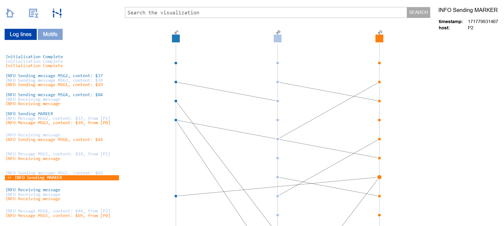

# Chandy-Lamport distributed algorithm
The Chandy-Lamport distributed algorithm is a famous algorithm to record a global consistent snapshot of a distributed system/application:<br>
a snapshot records the local state of each process along with the state of each communication channel used by the processes to communicate.

```@article{ChandyLamportDistributedAlgorithm,
Reference article:
• title={Distributed Snapshots: Determining Global States of a Distributed System},
• authors={Leslie Lamport, K. Mani Chandy},
• journal={ACM Transactions on Computer Systems},
• volume={3},
• number={1},
• pages={63-75},
• year={1985}
```


## Properties
This project is about design, implementation in Go, and evaluation of the Chandy-Lamport algorithm for snapshotting the global state of a distributed system.
The solution is tested on a pipelined deployed application that works like this: there are processes (or nodes) that all start with the same (integer) balance (in dollars); every second, each process transfers funds (an integer between 1 and 100 dollars) to another process at random; a process, also chosen at random, takes a snapshot of the system every two seconds; this whole process is carried out for a total of 10 seconds; funds transferred and snapshots taken are displayed to the user. Ultimately, an `output` directory will be created with network process logs and GoVector logs, which can be useful for monitoring, verifying, diagnosing, and replaying distributed system states.<br>
Then, this program calculates a snapshot of financial transactions based on the Chandy-Lamport algorithm.

For a more detailed specification of the system, please see the report.


## Setup
* To run the code you must have a correctly configured go development
environment. See [How to Write Go
Code](https://golang.org/doc/code.html).
<br><br>
* Once you set up your environment, first configure your network by editing the `net_config.json` file: for each node it is necessary to enter the index within the network (starting from 0), the name (“P” + node index), the IP address, the RPC port and the port of the application that manages the node same; then, it is necessary to enter the initial balance of the nodes and the number of attempts for the connection between the system components ("sendAttempts"), beyond which the system crushes.

## Usage
1) Launch the network nodes. You can do this by running the following command from the folder where the project is located:

   ```
   $ ./run-processes.sh
   ```
   Once the command is executed, wait until it appears that all processes are ready.
2) Launch the application with the command:

   ```
   $ go run app.go
   ```
3) Run the command:

   ```
   $ ./merge-output.sh
   ```
   This will merge the individual log files and create the file `output/GoVector/completeGoVectorLog.log` which can be used to print the application-generated trace of the Chandy-Lamport algorithm to [Shiviz](https://bestchai.bitbucket.io/shiviz/).
<br>
Here is an example screenshot of the ShiViz output generated from a run of the application:



## Dependencies
This project use [GoVector](https://github.com/DistributedClocks/GoVector) for drawing the trace of the network messages sent 
among the nodes to perform the global snapshot.
